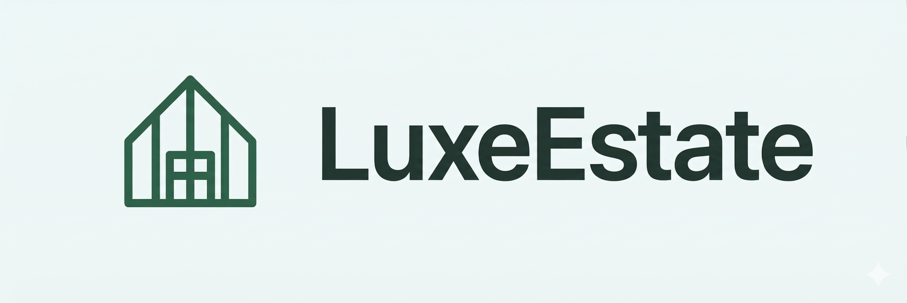

# Luxe Estate - Premium Real Estate Platform

 <!-- Replace with actual banner if available -->

**Luxe Estate** is a high-end real estate application designed to provide a premium, minimalist, and modern experience for buying and renting properties. Built with **Next.js 16 (App Router)** and **Supabase**, it follows strict architectural and design principles to ensure a "luxury" feel.

---s

## 🚀 Features

- **Premium Property Listings:** High-quality imagery and detailed information for luxury properties.
- **Advanced Search & Filtering:** Filter by price, property type, number of bedrooms, bathrooms, and location.
- **Interactive Maps:** Real-time property locations using Leaflet and React-Leaflet.
- **Favorites System:** Save your favorite properties for later viewing.
- **Admin Dashboard:** Complete management portal for properties and users.
- **Authentication:** Secure login and registration powered by Supabase Auth.
- **Internationalization (i18n):** Multi-language support for Spanish (default), English, and French.
- **Modern UI:** Built with Tailwind CSS 4, following the "Antigravity" design specs.

---

## 🛠️ Tech Stack

- **Framework:** [Next.js 16 (App Router)](https://nextjs.org/)
- **Styling:** [Tailwind CSS 4](https://tailwindcss.com/)
- **Database & Auth:** [Supabase](https://supabase.com/) (@supabase/ssr)
- **Maps:** [Leaflet](https://leafletjs.com/) & [React-Leaflet](https://react-leaflet.js.org/)
- **Linter/Formatter:** [Biome](https://biomejs.dev/)
- **Language:** TypeScript
- **Package Manager:** [Bun](https://bun.sh/)

---

## 🏁 Getting Started

### Prerequisites

- [Node.js](https://nodejs.org/) (Latest LTS)
- [Bun](https://bun.sh/) (Recommended)

### Installation

1. Clone the repository:
   ```bash
   git clone https://github.com/your-repo/luxe-state.git
   cd luxe-state
   ```

2. Install dependencies:
   ```bash
   bun install
   ```

3. Set up environment variables:
   Copy `.env.template` to `.env` and fill in your Supabase credentials:
   ```bash
   cp .env.template .env
   ```
   Required variables:
   - `NEXT_PUBLIC_SUPABASE_URL`
   - `NEXT_PUBLIC_SUPABASE_ANON_KEY`
   - `SUPABASE_SERVICE_ROLE_KEY`

4. Run the development server:
   ```bash
   bun dev
   ```

Open [http://localhost:3000](http://localhost:3000) to see the application.

---

## 🏗️ Project Structure

- `app/`: Next.js App Router pages, layouts, and API routes.
- `app/actions/`: Server Actions for data mutations (Auth, Properties, Language).
- `app/admin/`: Admin portal for property and user management.
- `components/`: Reusable UI components (Navbar, PropertyCards, Maps, etc.).
- `lib/`: Core utilities, Supabase clients, and i18n configuration.
- `antigravity/`: Design resources, core guidelines, and visual assets.
- `public/`: Static assets (Images, icons, fonts).

---

## 🎨 Design & Conventions

### Styling Guidelines
Luxe Estate follows the **Antigravity** design system. All UI elements must adhere to these specs:
- **Typography:** SF Pro Display (Mandatory).
- **Colors:**
  - **Nordic (#19322F):** Headers and main text.
  - **Mosque (#006655):** Primary actions.
  - **Hint of Green (#D9ECC8):** Featured elements.
  - **Clear Day (#EEF6F6):** Backgrounds.

For more details, check `antigravity/best-practices.md`.

### Architecture
- **Server Components First:** Use React Server Components by default.
- **Strict Formatting:** Always run `bun run lint` before committing.
- **Clean Architecture:** Keep logic separated into actions, lib, and components.

---

## 🌐 Internationalization

The app uses a custom i18n implementation. Supported locales:
- 🇪🇸 **Spanish** (es) - Default
- 🇺🇸 **English** (en)
- 🇫🇷 **French** (fr)

Dictionaries are located in `lib/i18n/dictionaries/`.

---

## 📜 Scripts

- `bun dev`: Starts the development server.
- `bun build`: Builds the application for production.
- `bun start`: Starts the production server.
- `bun run lint`: Runs Biome check and fixes formatting.

---

## 🔒 License

This project is private and proprietary. All rights reserved.

---

Developed with ❤️ for a premium real estate experience.
